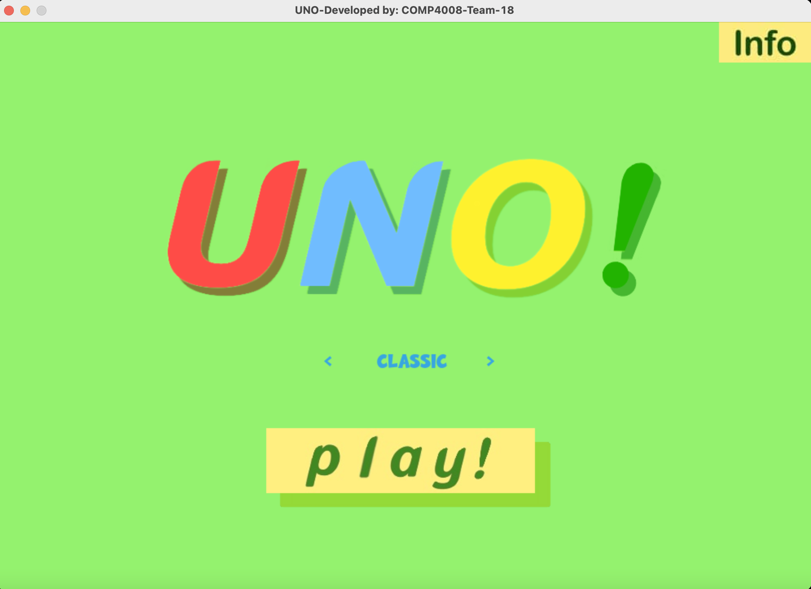
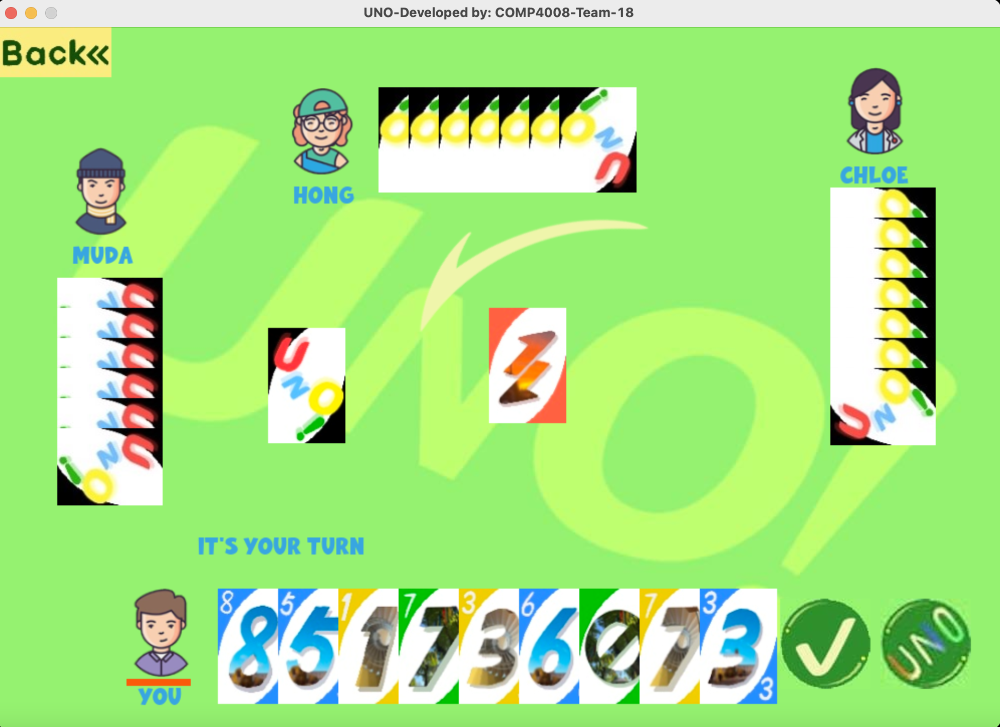
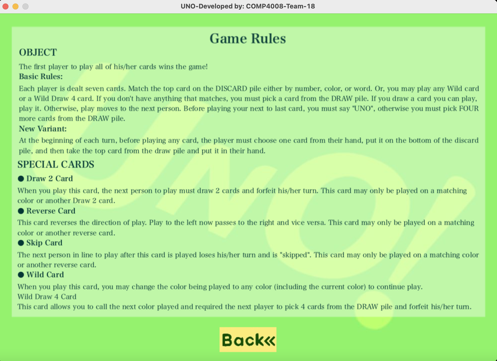

# Uno Card Game using Pygame
This is the final COMP4008 project for the 2022 Autumn semester.

<!-- image of home screen -->

## Briefly Introduction
- Desktop app of a pygame version of the fun board game UNO!
- One human player play against 3 AI bots.
- The game has two modes: Classic and New Variant
   
### New Variant 
At the beginning of each turn, before playing any card, the player must choose one card from their hand, put it on the bottom of the discard pile, and then take the top card from the draw pile and put it in their hand.

## Install and Running Instructions:

### Requirements:

**Python3.6:** Python3.6 is needed to run play_uno.py, it can be downloaded
for multiple OSes here:

<pre>https://www.python.org/downloads/release/python-360/</pre>

**Pygame:** After installing python3.6, use pip to install pygame:

<pre>$pip install pygame</pre>

**Operating system:** This Uno gam has been successfully run on Mac. Other operating systems are likely possible if they can
correctly operate python, and pygame.

### Startup:

Using either git to pull a copy of repo or extracting the zip containing the
main working files of the repo. You can use either program IDE or terminal to start the app.
If you use terminal to navigate to the extracted folder. 
Then use python to run the main starting script, the following command is required:

<pre>python play_uno.py</pre>

After this play_uno.py should be running and you are free to enjoy.

## Controls:
**Most actions can be done by clicking the buttons.**

After a game of Uno is done, the player can click return button to go back to 
the homepage and restart to a new game of Uno.

## Screenshots

## Card Design

Card design by Wang Lanxuan, 2022 Autumn COMP4008 student.